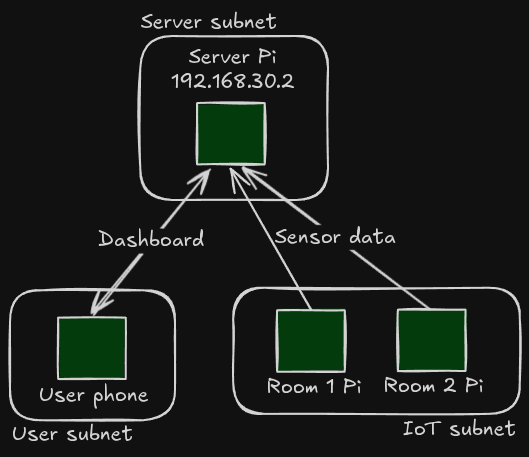

# Lightbrary

## Data flow diagram



## Device roles

Room Pis:

- Infer if its room is `Available` or `Occupied` via sensor data
- Send room status periodically to the server via MQTT

The server Pi:

- Runs the MQTT broker
- Runs a DNS server to map `dashboard.lightbrary` to its own IP address
- Keeps a log of room status changes on a file
- Serves a HTTP dashboard listing the status changes and current status of each room

User devices:

- View the HTTP dashboard from the server
- Occasionally poll the server for room status updates

## Data exchange between Room Pis and Server Pi

Room Pis publish room status to the `rooms/{room_id}/status` topic once every 30 seconds.
When a Room Pi is started, it must wait a random amount between 1 to 30 seconds before sending its first message to even the load on the Server Pi.
The payload is a JSON string of the format:

```ts
{
  status: 'Available' | 'Occupied',
  timestamp: number, // Unix timestamp, 1-second resolution
}
```

If the Server Pi does not receive a room status from a Room Pi for more than 60 seconds, that room is considered `Offline`.
